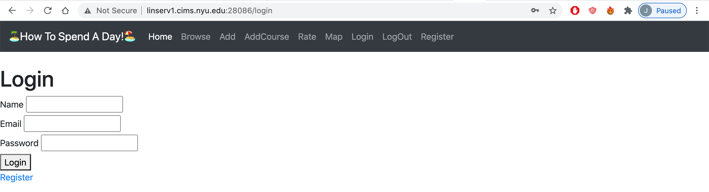
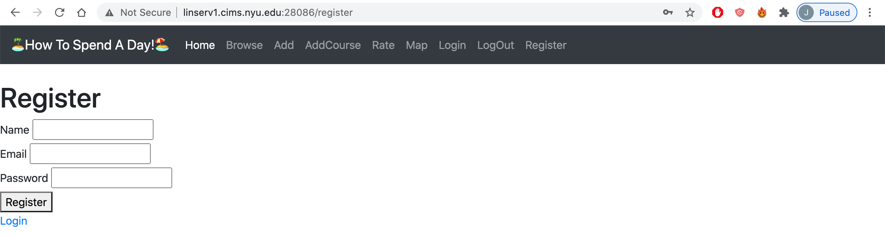
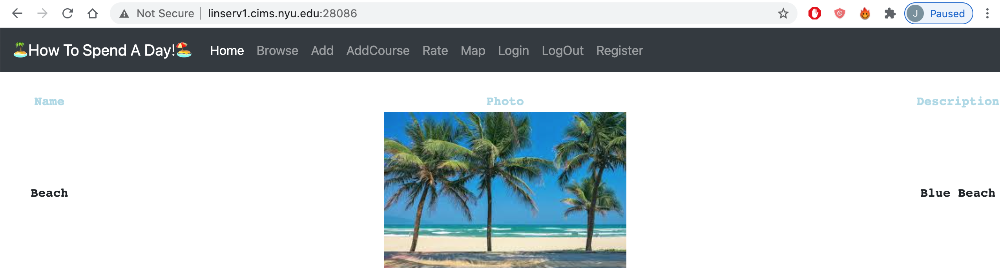
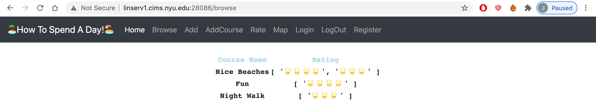
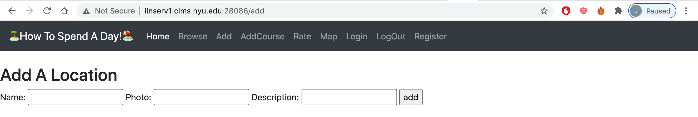
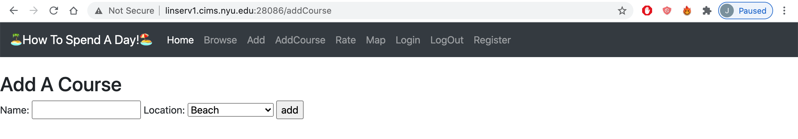
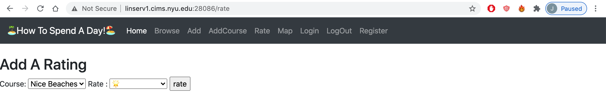
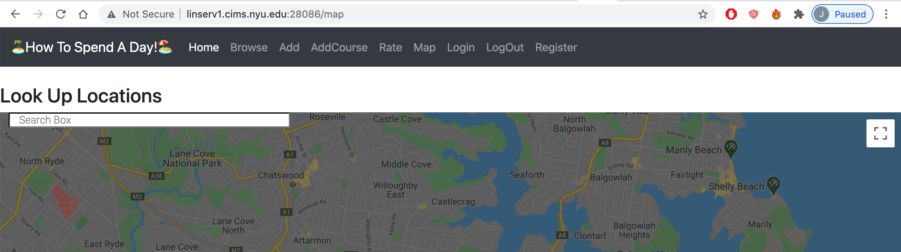

#  How To Spend A Day!

## Overview

Sometimes, we get bored of our mundane day. Have you ever ran into an issue planning for a day-out? Have you ever wished someone else planned your day for you? Let "How To Spend A Day!" help you!

"How To Spend A Day!" is a web app that will allow users to share their day-out plans and experiences. Users can register and login. Once they're logged in, they can create their day-out courses. They will be able to locate places on the map and upload photos and tag descriptions.

## Data Model

The application will store Users, Courses, Locations, Photos, Descriptions, and Ratings. 

* users can have multiple courses (via references)
* each course will have one Rating (via references)
* each courses can have multiple locations (by embedding)
* each locations can have multiple photos and one description (by embedding)

An Example User:

```javascript
{
  username: "Chrissy",
  email: // an email,
}
```

An Example Course with Embedded Locations, Photos, and a description:

```javascript
{
  user: // a reference to a User object
  Course Name: "Summer Date",
  Locations: [
    { name: "Restaurant", Photo: {link/uploaded path to photos}, Description: "Nice food!"},
    { name: "Amusement Park", Photo: {link/uploaded path to photos}, Description: "Fun Rides"},
  ],
  Rating : String
}
```

## [Link to Commented First Draft Schema](db.js) √


## Wireframes

/login - page to login



/register - page to register



/ (Home) - page to browse all locations



/browse - page to browse all courses and ratings



/add - page for add a location



/add - page for add a course



/rate - page for rating courses



/map - page for searching locations



## Site map


## User Stories or Use Cases

1. as non-registered user, I can register a new account with the site
2. as a user, I can log in to the site
3. as a user, I can create a new course
4. as a user, I can view all the shared locations
5. as a user, I can seach locations
6. as a user, I can rate courses

## Research Topics

* (3 points) Integrate user authentication
    * I'm going to be using passport.js for user authentication
    * It is authentication middleware for Node.js. It supports authentication using a username and password, Facebook, Twitter, and more. 
    * It is extremely flexible and can be dropped into any Express-based web application
* (3 points) External API
    * I will be using Google Map API for map incorporation.
    * It lets us to customize maps with our own content and imagery for display on web pages.
    * It is the most familiar Map API so that users on the website can use it without learning them. 
* (2 points) CSS Framework
    * I will be using Bootstrap for the framework.
    * It is the most popular HTML, CSS, and JS library in the world. 
    * It can be used to quickly design and customize responsibe sites.

8 points total out of 8 required points


## [Link to Initial Main Project File](app.js) √

## Annotations / References Used

1. [passport.js authentication docs](http://passportjs.org/docs)
2. [Google Map API](https://developers.google.com/maps/documentation/javascript/overview)
3. [Bootstrap](https://getbootstrap.com/docs/4.5/getting-started/introduction/)
